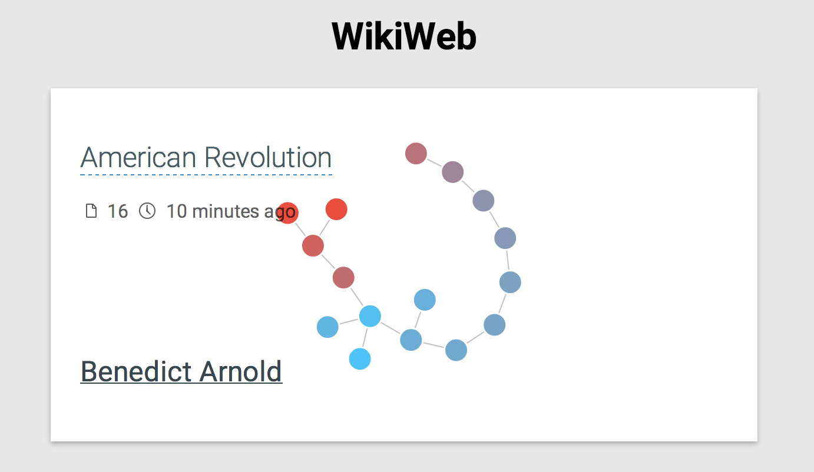

WikiWeb
=======

### Building

- npm install -g bower
- bower install

### Track your wikipedia surfing!

0. Download the folder, open it in Chrome extensions
1. Click the icon
2. Hit record
3. Have a party
4. Hit stop
5. Click "Past sessions"

Screenshot:

